# TP5: Image Formation
## Exercise 1: Implementation

When tp5 is run, it asks whether you want to use the orthogonal or perspective projection. You have to choose between the two by selecting 1 or 2. Then, depending on your choice, the program will ask you to choose a focal value or a threshold value. The threshold value that we used in our test is 1.6.

### Question 1.  How does the image change if we modify the following parameters: focal length, object transform, image center, and image resolution ?

a) Focal

Here are the results we obtained when we changed only the focal value. We tested the following values (from left to right and up to down): 0.1, 0.3, 0.5, 1, 2, 10.

We can see that increasing the focal makes the object in the image larger. It also reduces the depth of the image. It is logical when you look at the formula : the smaller the focal, the larger the denominator. 

Furthermore, when f tends toward infinity, X_img and Y_img have X_p' and Y_p' as limits. Thus, by increasing the focal, the projection looks more and more like an orthogonal projection: x and y are not modified and all points are projected inside of the plane with equation "z=0". 

b) Object transform

This is what we get for making a rotation aroud the x-axes for angles pi/2, pi, 2pi/3 and 2pi.

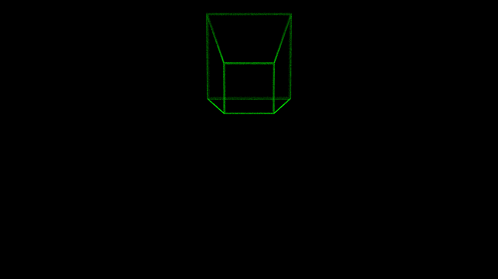
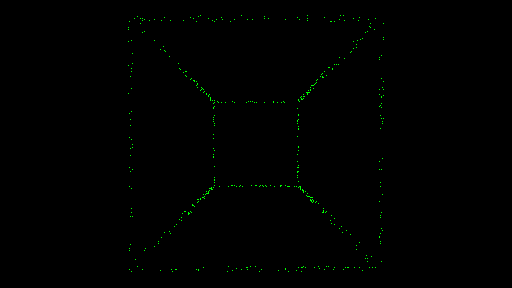

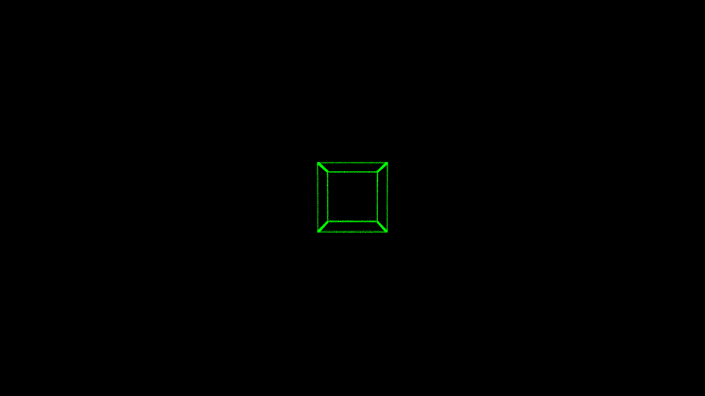

This is what we get for making a rotation aroud the y-axes for angles pi/2, pi, 2pi/3 and 2pi.

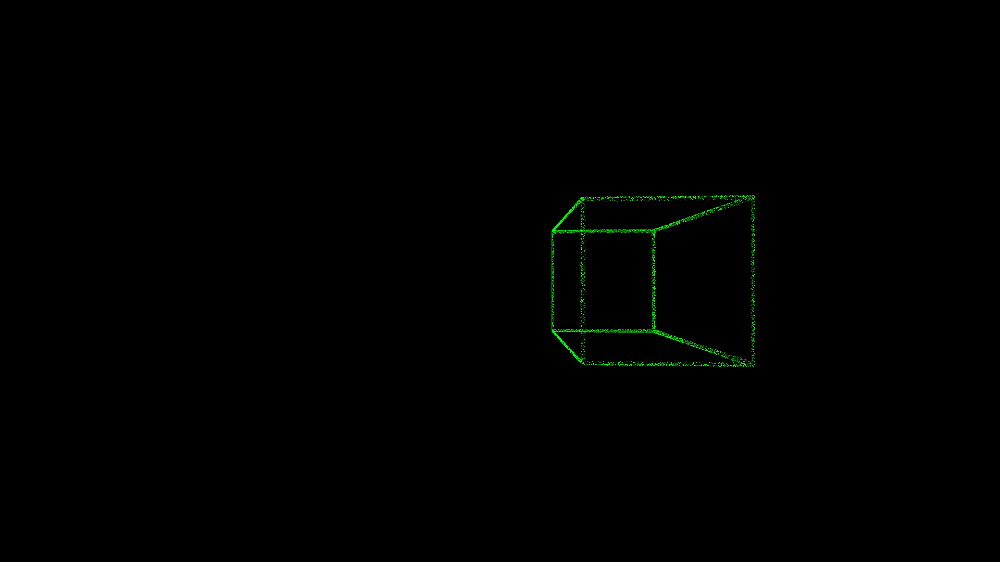
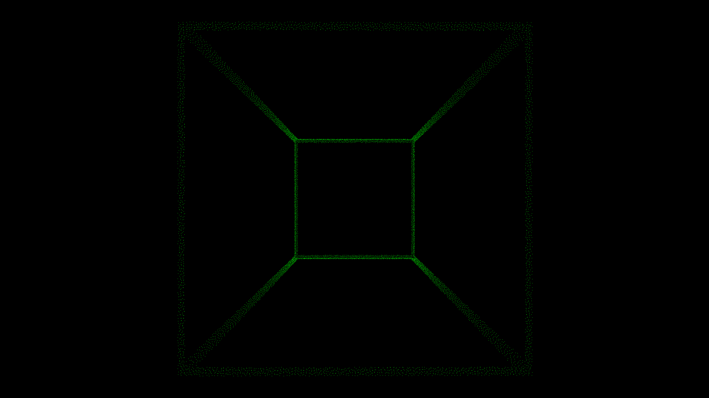
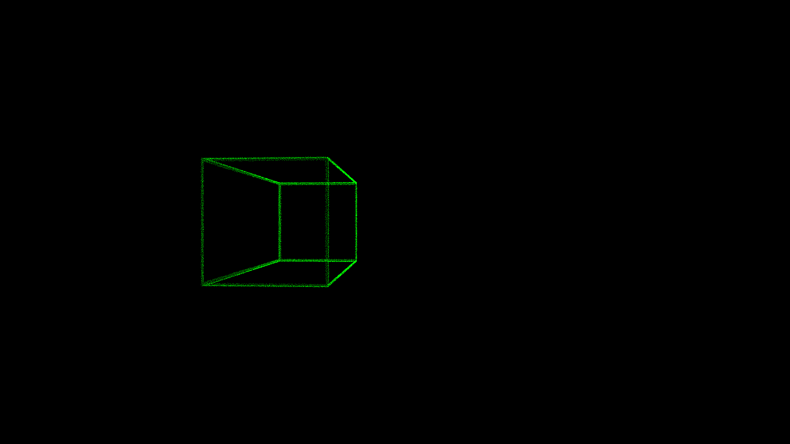
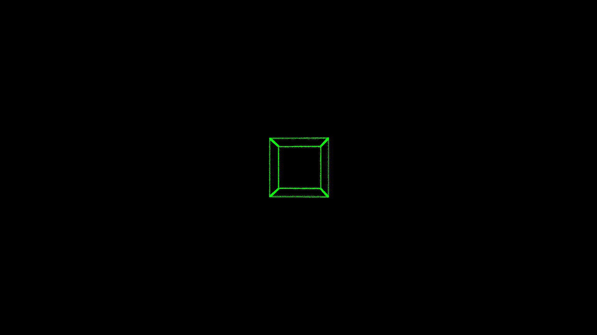

This is what we get for making a rotation aroud the z-axes for angles pi/2, pi, 2pi/3 and 2pi.

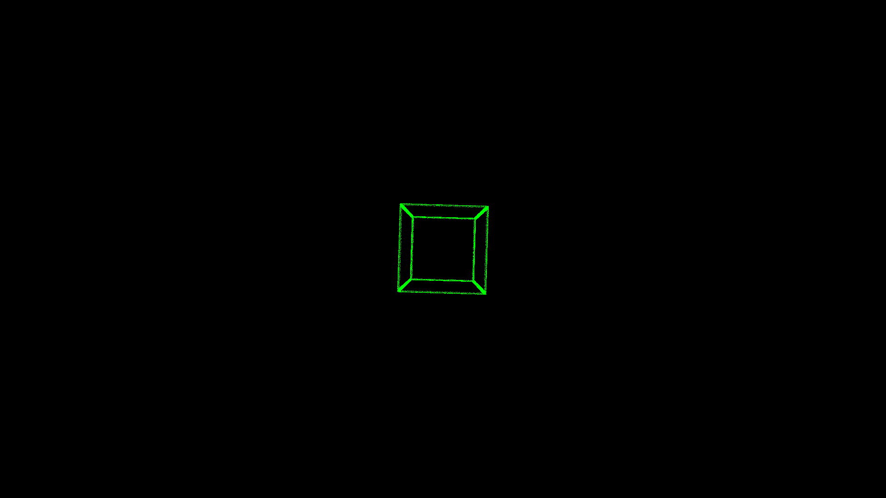
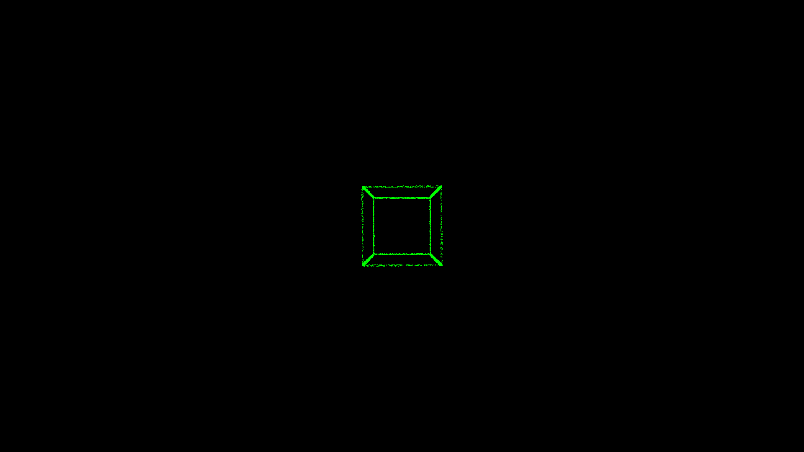
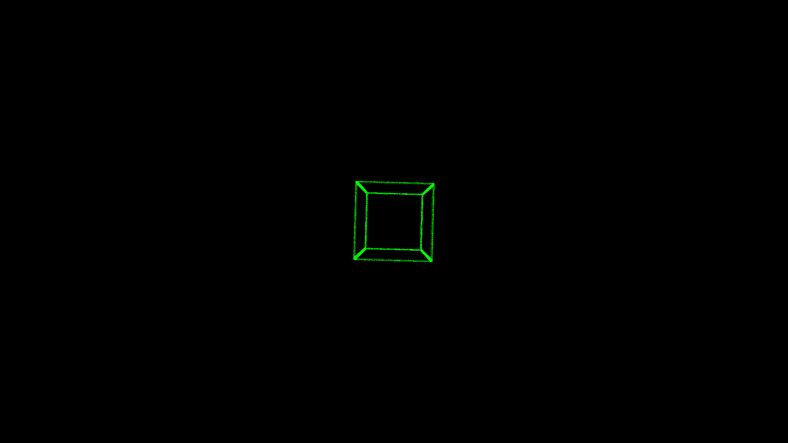
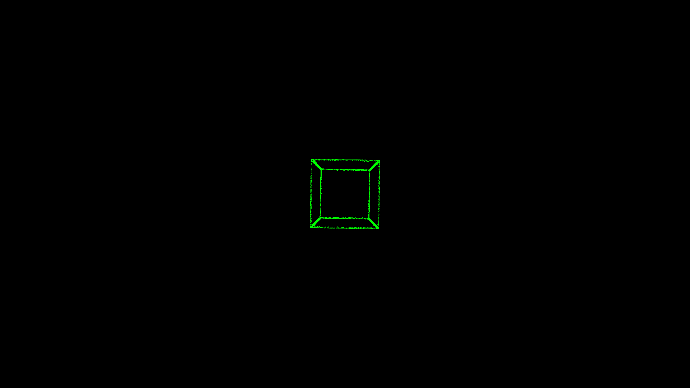

And here is what we get for a translation of -1 and 1 in all 3 directions.

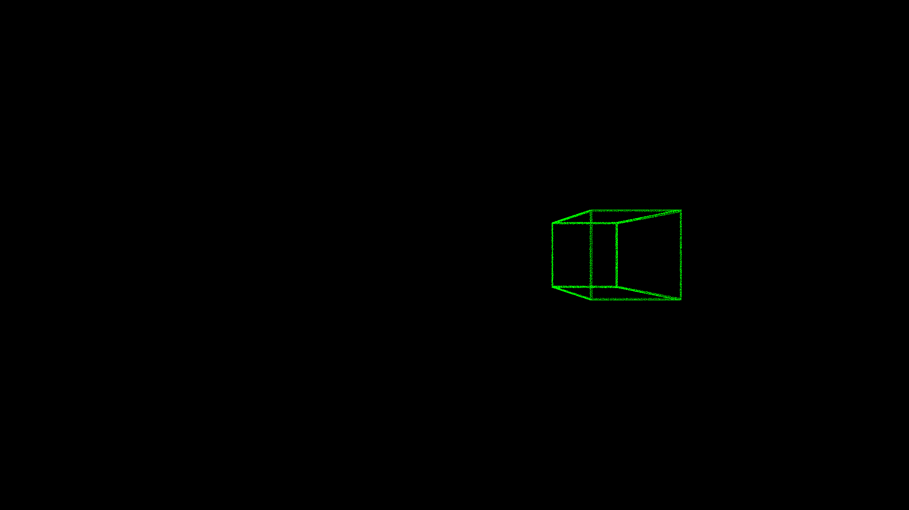
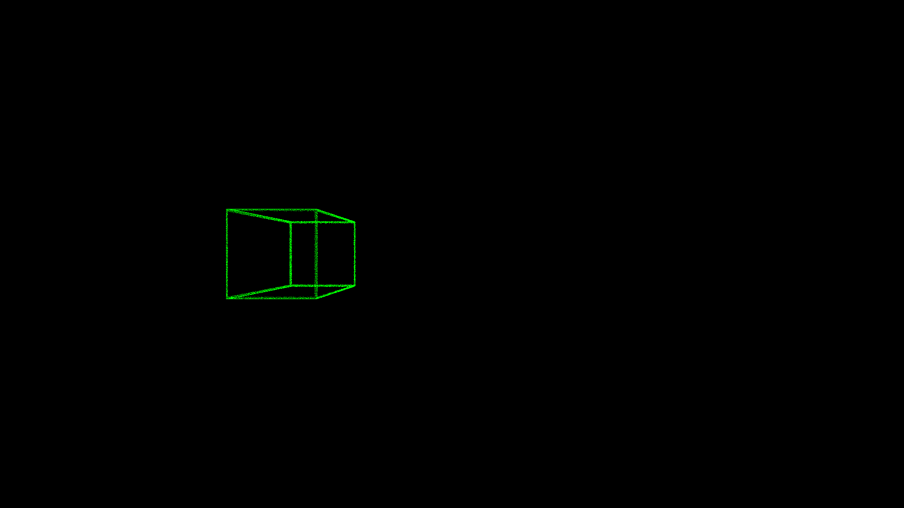
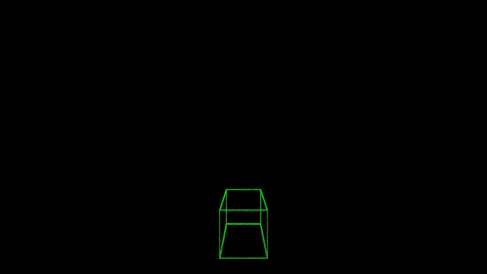
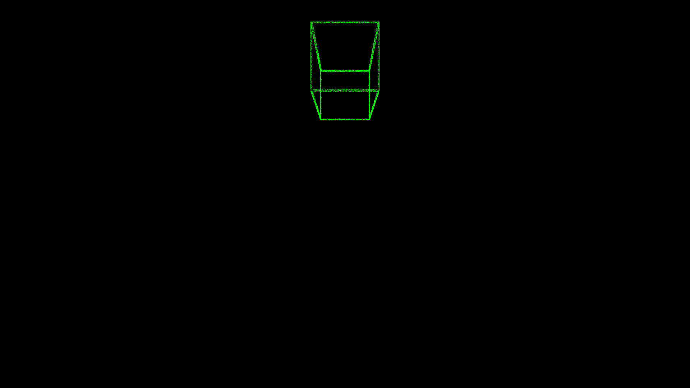
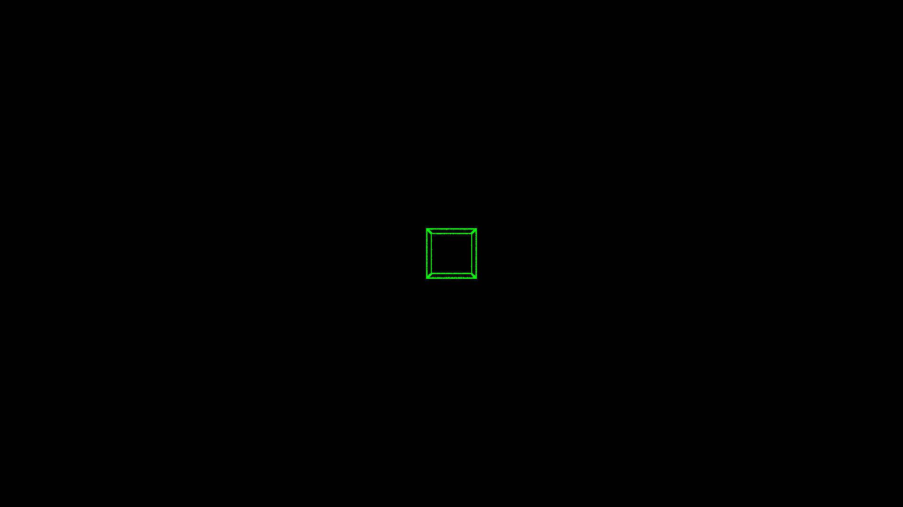
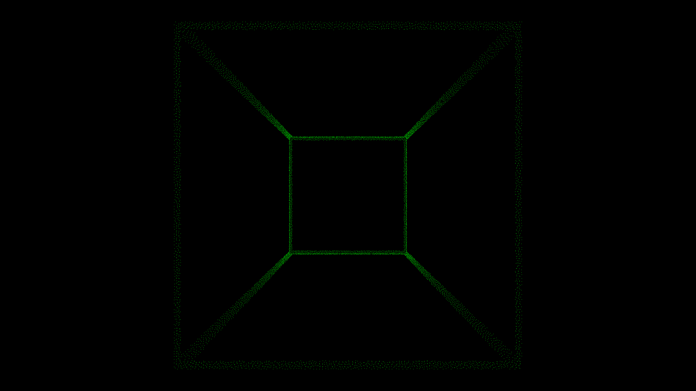

c) Image center

Here are the results we obtained when the center position is the only parameter we changed. We tested the following values (from left to right and up to down): (width//2, lenght//2), (width//3, lenght//2), (width//2, lenght//3), (width//4, lenght//4).

As the formula takes into account the location of the center, changing the center of the image modifies the position of the object. In fact, by adding u_0 and v_0 to x and y each time, we induce a translation that corresponds to the translation between the point (0,0) and (u_0,v_0), allowing us to change the center of the image as needed.

We can see that in the first image, the cube is centered. In the other pictures, it moves accordingto the position of the center.

d) Image resolution

Here are the results we got when the resolution (alpha_u, alpha_v) was the only parameter we changed. We tested the following values (from left to right and up to down): (4//width ,4//width), (3//width, 3//width), (3//width ,1//width), (1//width ,3//width), (4//width, 3//width), (6//width ,1//width).

Resolution usually corresponds to the size of pixels and their concentration. Here, the size doesn't really change but the concentration does. By dividing each value by a factor we can choose wether we want a high concentration of pixels per meter or not. 

We can decide to make the edges more or less stretched resulting in thinner or thicker edges. We notice that if alpha_u is different from alpha_v, we get a modified shape compared to what we had initially. Indeed, it is clear that on the 4 images of the bottom we get something closer to a rectangle than a square. Once again, the fact that the divising factor is different for x and y in the formula explains it. 

### Question 7

In order to implement an occlusion method, we decided to use a threshold on z. It works as if we were cutting the 3D image at the choosen threshold on the z axis, displaying only the front part when we project it. This way, we can remove parts such as the hood and make the projection clearer.

Doing that, we create holes in the projection (the one that used to be part of the hood for example). To correct it, we implemented the fill_holes() function. The result isn't perfect but it's much better than before. 

