# TP5: Image Formation
## Exercise 1: Implementation

When tp5 is executed, it asks wether you want to use the orthogonal or persêctive projection. You have to choose between the two by selecting 1 or 2. Then, depending on what you chose, the program will ask you to choose a focal value or a threshold value. The threshold value that we used in our test is 1.6.

### Question 1.  How does the image change if we modify the following parameters: focal length, object transform, image center, and image resolution ?

a) Focal

Here are the result we got for when we only modify the focal value. We tested the following values (from left to right and up to down): 0.1, 0.3, 0.5, 1, 2, 10.

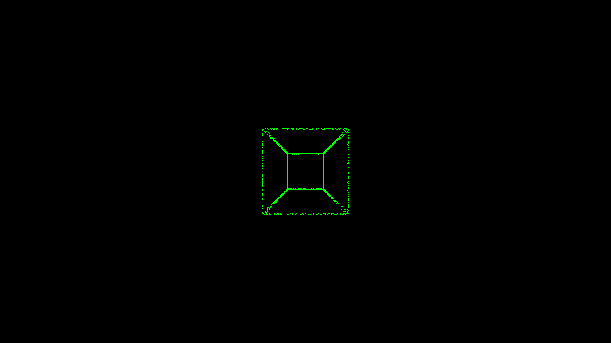
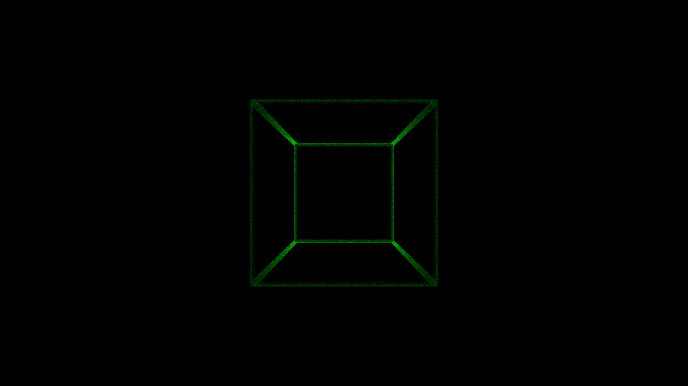
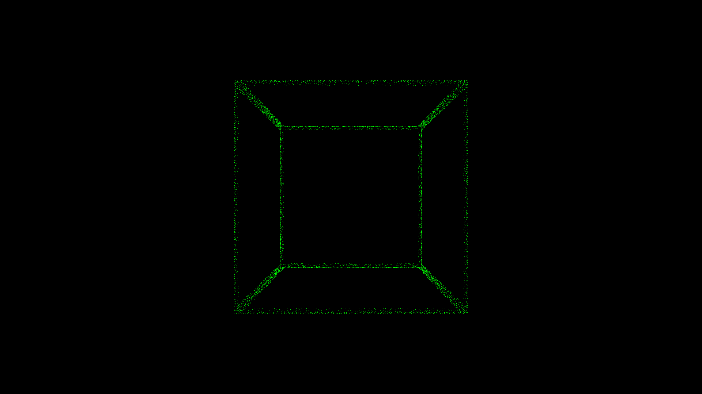
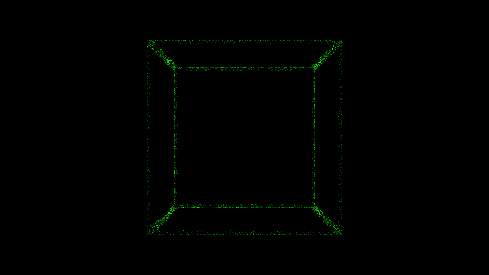
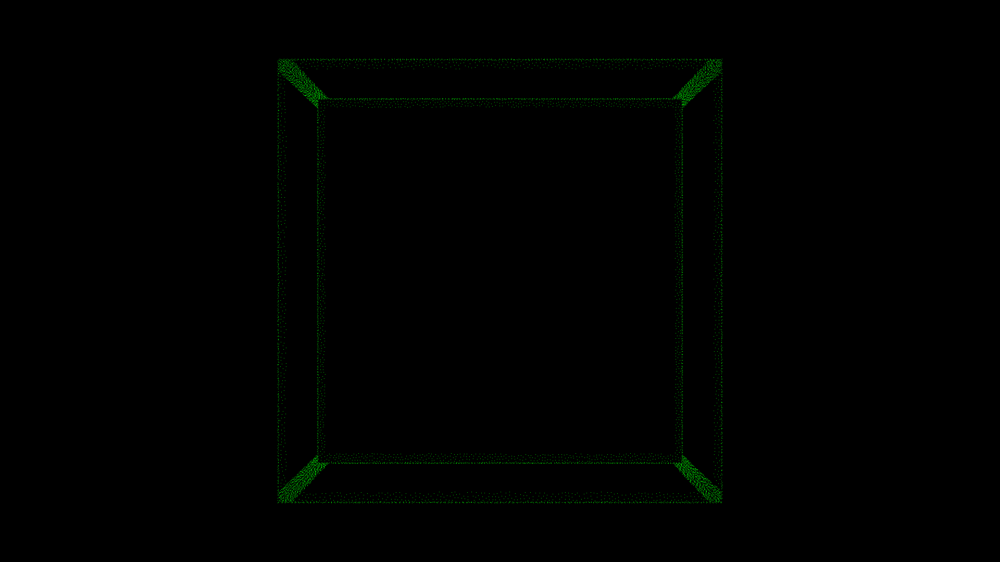
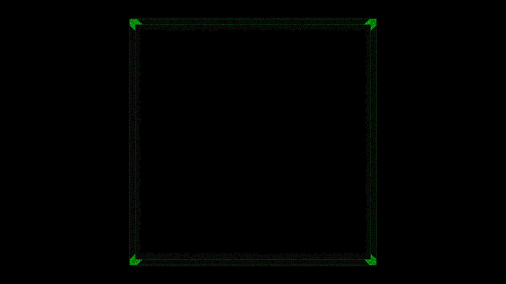

We can see that increasing the focal makes the object of the image bigger. it also reduces the image depth. It makes sens when we look at the formula : the smaller the focal is, the bigger the denominator is. 

Furthermore, when f tends toward infinity, X_img and Y_img have X_p' and Y_p' as limits. Thus, by increasing the focal, the projection becomes more and more like an orthogonal projection: x and y aren't modified and all points are projected inside of the plan with equation "z=0". 

b) 

c) Image center

Here are the result we got when the center position is the only parameter we modified. We tested the following values (from left to right and up to down): (width//2, lenght//2), (width//3, lenght//2), (width//2, lenght//3), (width//4, lenght//4).

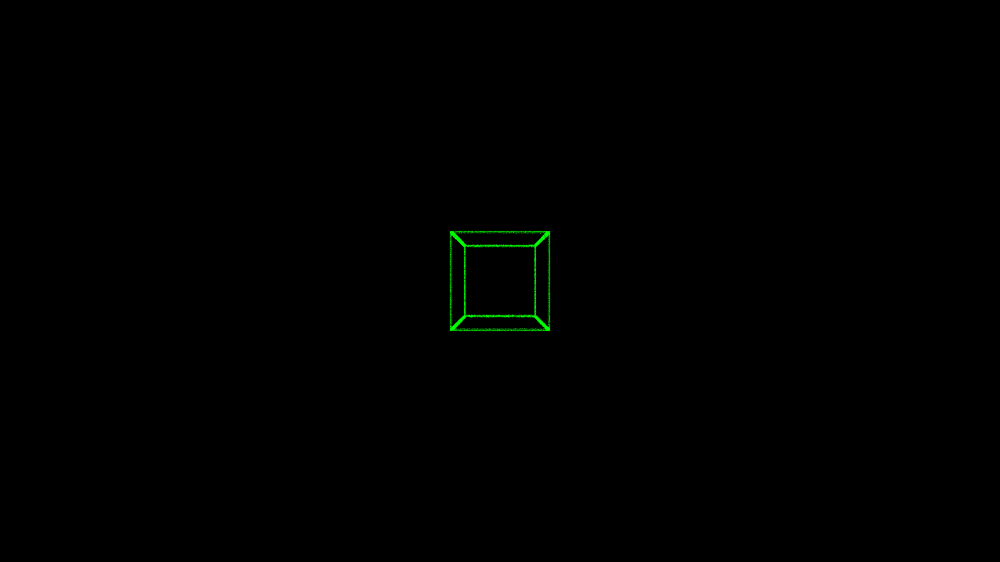
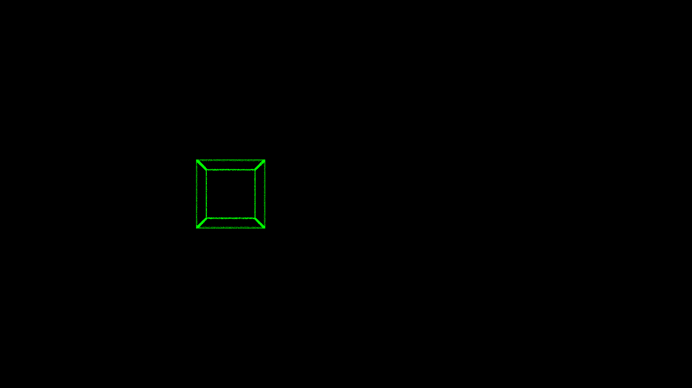

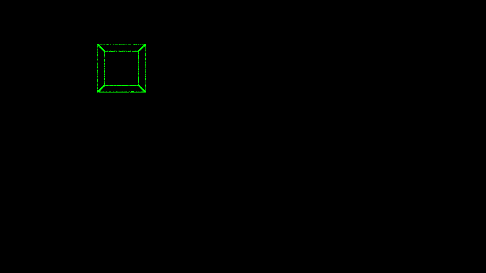

Because the formula takes into account where the center is placed, modifying the center of the image modify the position of the object in the image. Indeed, because we add u_0 and v_0 to x and y each time, we induce a traslation that correspond to the translation between the point (0,0) and (u_0,v_0) which enable to change the center of the image as needed.

We see that on the first image the cube is centered. In the other pictures, it mooves accordingly to the position of the center.

d) Image resolution

Here are the result we got when the resolution (alpha_u, alpha_v) is the only parameter we modified. We tested the following values (from left to right and up to down): (4//width ,4//width), (3//width, 3//width), (3//width ,1//width), (1//width ,3//width), (4//width, 3//width), (6//width ,1//width).

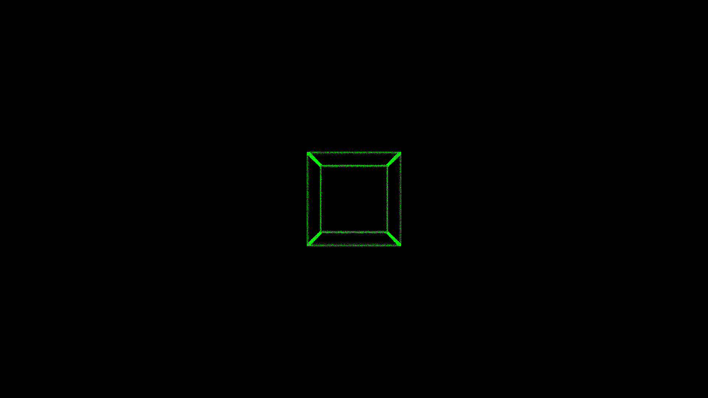
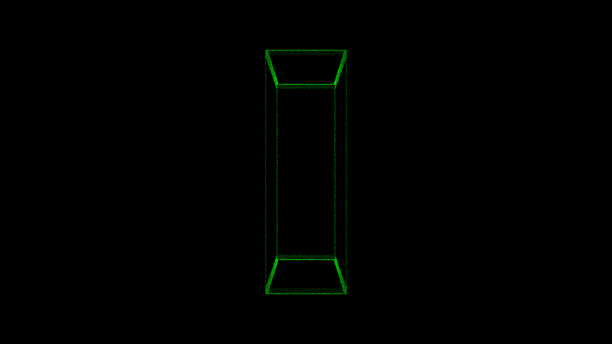
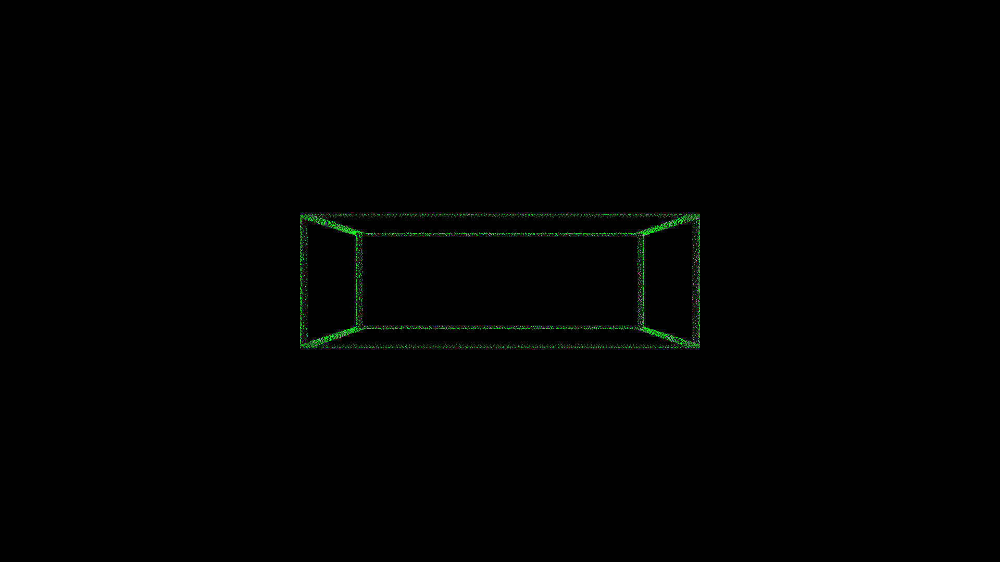
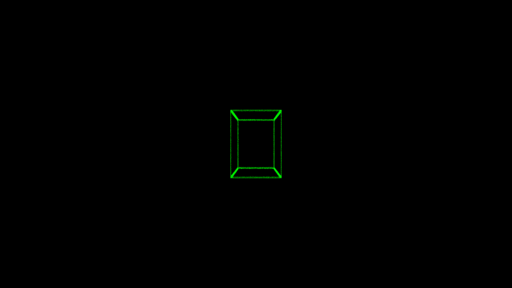
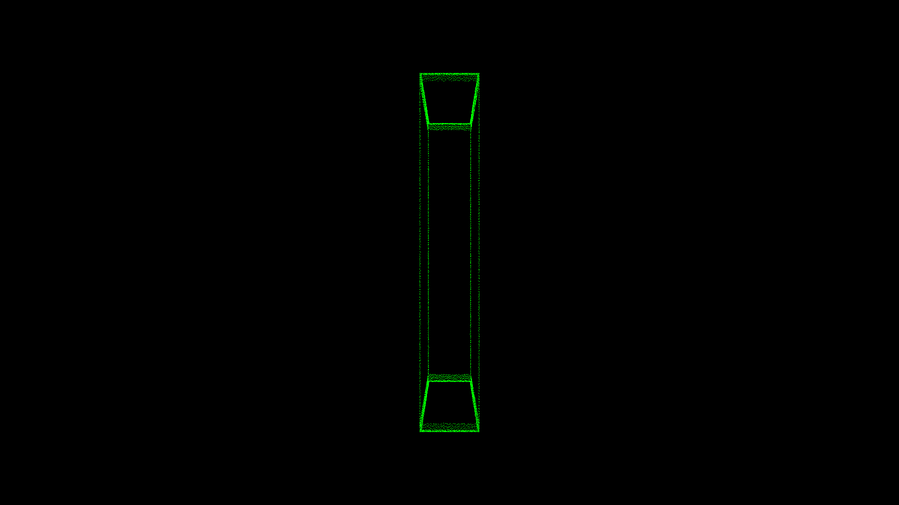

Resolution usually means the size of a pixel and their concentration. Here, the size doesn't really change but the concentration does. By dividing each value by a factor we can choose wether we want a high concentration of pixels by meter or not. 

We can decide to make the edges more or less stretched resulting in thiner or thicker edges. We notice that if alpha_u is different from alpha_v, we get a modified form from what we originally had. Indeed, it is clear that on the 4 images of the bottom we get something closer to a rectangle than a square. Once again, the fact that the divising factor is different for x and y in the formula explains it. 

### Question 7

In order to implement an occlusion method, we decided to use a threshold on z. It works as if we were cutting the 3D image at the choosen threshold, displaying only the front part when we prohect it. This way, we will be able to remove parts such as the hood and make the projection clearer.

Doing that, we are creating holes in the projecction (the one that used to be part of the hood for example). To correct that, we implemented the function fill_holes(). The result isn't perfect but still way better than before. 

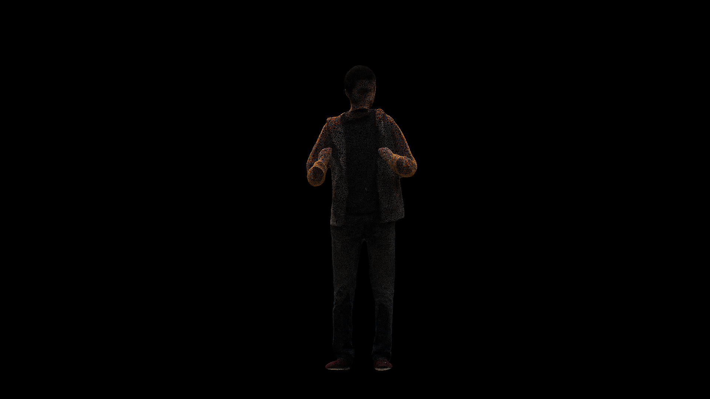
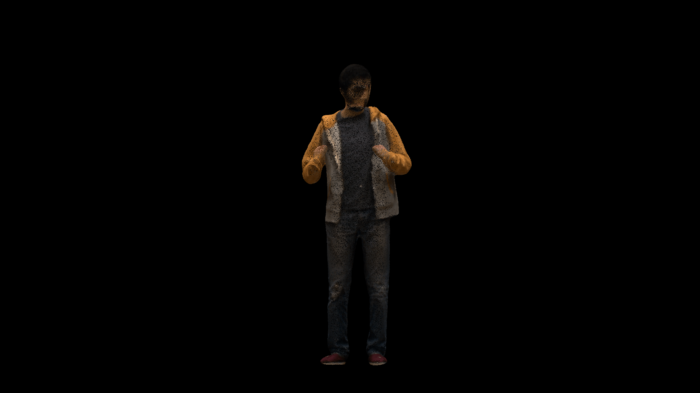

